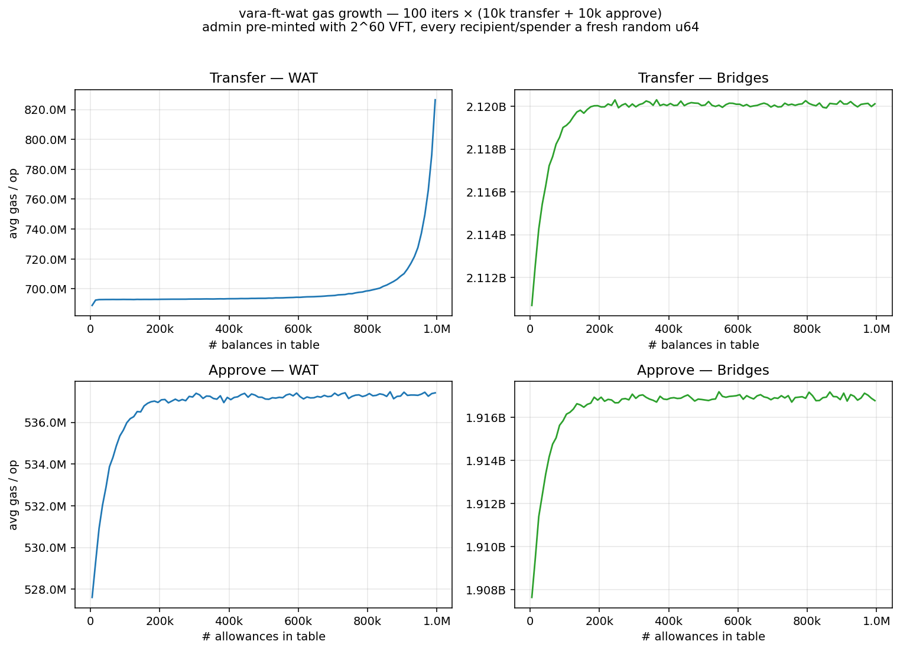

# vara-ft-wat

A hand-written **Vara fungible-token (VFT)** contract implemented directly in
WebAssembly Text format (WAT), plus a benchmark CLI that compares its
per-operation gas cost against the sails-based VFT from
[`gear-tech/gear-bridges`](https://github.com/gear-tech/gear-bridges/tree/1f5f61a/gear-programs/vft).

The WAT contract is byte-compatible with the standard sails-rs `Vft` service
wire protocol (`SCALE("Vft") ++ SCALE("<Method>") ++ <params>`) — existing
clients/IDLs that talk to the
[`extended-vft`](https://github.com/gear-foundation/standards/tree/master/extended-vft)
or to gear-bridges' `Vft` service work against it unchanged.

## Results



The plot is the output of a full default run: **100 iterations** × (10 000
transfers + 10 000 approves), every recipient/spender a fresh random `u64`,
admin pre-minted with `2^60` VFT. Each iteration adds ≈10 k entries to the
balances table and ≈10 k to the allowances table; the x-axis is the entry
count at the midpoint of the iteration.

### Gas per operation

| Op         | WAT first → last (Δ)         | gear-bridges first → last (Δ) | bridges / WAT |
|------------|------------------------------|-------------------------------|---------------|
| Transfer   | **689 M → 827 M (+20.0 %)**  | 2.111 B → 2.120 B (+0.5 %)    | 2.57–3.08 ×   |
| Approve    | 528 M → 537 M (+1.9 %)       | 1.908 B → 1.917 B (+0.5 %)    | 3.57–3.62 ×   |

The growth on the WAT Transfer panel is the hash-table-load artefact
described in the [Caveat](#caveat-wat-balance-table-sizing) section: at
2^20 balance slots, ~1 M entries push the table to 95 % load and probe
chains start crossing 64 KB lazy-page boundaries.

`gear-bridges` setup cost (one-time, before the benchmark loop):

| Op                                              | Gas      |
|-------------------------------------------------|----------|
| `VftExtension::AllocateNextBalancesShard`       | 329 B    |
| `VftExtension::AllocateNextAllowancesShard`     | 165 B    |
| `VftAdmin::Mint(admin, 2^60)`                   | 1.89 B   |

### WASM binary size

| Contract                                           | Size       |
|----------------------------------------------------|------------|
| `vara-ft-wat` (this repo, WAT → WASM)              | **5 727 B**|
| `gear-bridges/gear-programs/vft` (`vft.opt.wasm`)  | 93 774 B   |

The WAT module is **~16× smaller** than the sails-optimised bridges binary.

## Algorithm

The contract is a single `(module …)` declaration with **no Rust runtime, no
allocator, no `sails-rs` machinery** — only `gr_size`, `gr_read`, `gr_source`,
`gr_reply`, and `gr_panic` are imported from `env`.

**Memory layout** (lazy pages — only touched pages are charged):

```
page 0            stack + per-call scratch (IN_BUF / OUT_BUF / U256 temps)
page 1            meta (routes blob, name/symbol, decimals, total_supply)
page 2            roles (admins / minters / burners, ≤639 each)
pages 3..1026     balances  : 2^20 slots × 64 B = 64 MB
pages 1027..13314 allowances: 2^23 slots × 96 B = 768 MB
pages 13315..32767 unused; declared up-front because memory.grow is banned
```

**Hash tables**: two **open-addressing tables with linear probing**. Fibonacci
multiplicative hashing (`× 0x9E3779B9`) followed by a right-shift to keep the
top 20 bits (balances) or top 23 bits (allowances). An "empty" slot is one
where the key region is all zero. When a balance or allowance becomes zero
the slot is left in place as a tombstone with `value = 0` — this preserves
probe chains and is functionally indistinguishable for the read paths.

**U256** is implemented as four `i64` little-endian limbs with manual
carry/borrow loops.

**Wire protocol** is exactly sails-rs `Vft`: `SCALE("Vft") ++ SCALE("<Method>")
++ params`. Routes are precomputed as `compact-len + name` blobs at fixed
offsets inside page 1; dispatch is a hand-unrolled `memeq` chain ordered by
expected call frequency (Transfer first).

**Defensive panic on big inputs**: legitimate VFT payloads are <120 bytes.
On entry to `handle`/`init`, if `gr_size > 1024` we `gr_panic` immediately —
this protects the 1 KB `IN_BUF` from `gr_read` overflow.

### How this differs from `gear-bridges` Rust VFT

| | `gear-bridges` (sails + awesome-sails) | `vara-ft-wat` |
|---|---|---|
| Language | Rust, compiled to WASM via `sails-rs::build_wasm` | hand-written WAT, compiled via the `wat` crate at build time |
| Runtime | sails-rs message dispatch, scale-codec, gstd, allocator | nothing — direct `gr_*` syscalls, no allocator, no panic-handler crate |
| Balances storage | `Balances<Balance10>` = sharded `HashMap` (`ShardedMap`) — shards must be allocated explicitly via `VftExtension::AllocateNextBalancesShard` before any mint succeeds; cost ~329 B gas to materialise a 14 M-slot shard | open-addressing array at a fixed memory offset, lazy pages cover the 64 MB region for free until written |
| Allowances storage | `Allowances<Allowance9>` = sharded `HashMap`, 7 M-slot shard, plus an `expiry_period` mechanism that times allowances out after a configurable number of blocks | open-addressing array at a fixed memory offset, 8 M slots, no expiry |
| Mint route | `VftAdmin::Mint`, takes `Result<(), Error>` via `unwrap_result` | folded into the `Vft` service (matches `extended-vft`) |
| Multi-service | exposes `Vft`, `Vft2`, `VftAdmin`, `VftExtension`, `VftMetadata` | single `Vft` service covering the standard surface |
| WASM size | ~93 KB (optimised) | ~5.7 KB |
| Gas per Transfer / Approve | ~2.1 B / ~1.9 B (flat once shards are allocated) | ~0.69 B / ~0.53 B (flat until table load exceeds ~85 %) |
| Failure modes | HashMap rehash when `space() == 0` (must allocate a new shard explicitly); allowance expiry implicit on read | probe-chain bloat as load approaches 100 %; no expiry |

The biggest practical difference: `gear-bridges` pays a ~500 B gas
one-time setup tax to make any mint legal, but then every subsequent op is
cheap-and-flat by design. The WAT contract has **no setup tax** and is
~3× cheaper per op as long as the load factor on the chosen table stays
moderate.

### Caveat: WAT balance-table sizing

With the current 2^20 balances slots, ~1 M entries put the table at 95 %
load and per-Transfer gas climbs from 693 M to 827 M over the last
~100 k inserts of the default benchmark. For workloads above ~500 k
unique holders bump the balances table to 2^21 (or 2^22):

- in `wat/extended_vft.wat`, `$hash_actor`: change the trailing
  `(i32.shr_u … (i32.const 12))` to 11 or 10
- in `$bal_find`: bump the wrap mask `0xFFFFF` and probe-cap `1048576`
- in the same file, shift `ALLOW_BASE` higher to leave room for the
  larger balances region

Lazy pages keep the extra address space free until it is actually written.

## Building and running

Requirements: a recent Rust toolchain (matching gear-core 1.10), Python 3
with `matplotlib`, and network access for the first build (gear-bridges is
pulled in via cargo at a pinned commit).

```bash
# Builds the workspace, transitively compiling wat/extended_vft.wat → WASM
# via the `wat` crate, and pulling gear-bridges' vft for its WASM_BINARY.
cargo build --release

# Run the benchmark. Defaults: --iters 100 --ops 10000 --impls wat,bridges.
./target/release/bench

# Smoke-size run: 5 iters × 200 ops each, only the WAT impl.
./target/release/bench --iters 5 --ops 200 --impls wat

# Drop the plot step (CSV only):
./target/release/bench --no-plot
```

The CLI writes one `gas_growth_<impl>.csv` per impl into `results/` and then
invokes `scripts/plot_gas_growth.py` to render `results/gas_growth.png`.

## Authorship

This project was produced end-to-end by [Claude Code](https://claude.com/claude-code)
(model: Claude Opus 4.7, 1M-context). Approximate token usage to take the
project from "implement extended-vft as a hand-written WAT contract" to its
current state (including all of the debugging, gas-ablation experiments,
gear-bridges integration, plot iterations, and this README): **on the order
of 2–3 million tokens**.

## License

MIT — see [LICENSE](LICENSE).
